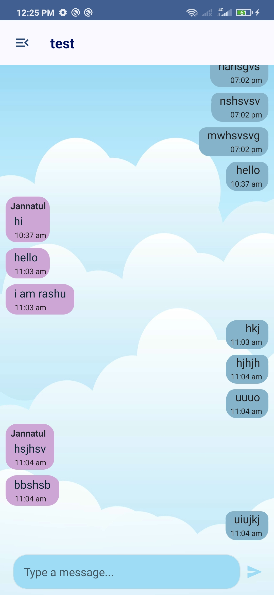

# SAT.R a TaskChatting App

A comprehensive task management and communication platform designed specifically for student group projects. This Android application facilitates group creation, task management, and real-time communication, developed as part of the Edge Course Mobile App Development program under the mentorship of Sourav Palit (Principal App Engineer, Getonnet) and Hasan Murad (Assistant Professor of CSE, CUET).

## Project Context

SAT.R a TaskChatting App serves as a practical implementation of modern Android development practices, focusing on group collaboration and task management. This project was created while studying Computer Science and Engineering at Chittagong University of Engineering & Technology (CUET).

## Demo Video

Check out our application demo to see SAT.R in action:

-[Click This Link](https://drive.google.com/file/d/1k3T4bCJAd_c7BuX-9dTZSIQ7AaiDkyyB/view?usp=drive_link)

### Authentication System
For detailed information about our authentication implementation, please refer to the following documentation:
- [Authentication System Documentation](Screentshots/Authentication_method.pdf)

This documentation covers:
- User registration flow
- Password Recovery
- Firebase Authentication integration
- Authentication state management

## Screenshots

### App Flow

### Authentication

### Group Management

### Task Management & Communication

## Features

### Core Functionality
- **User Management**:
    - User registration and authentication
    - Profile management
    - Secure login system

- **Group Management**:
    - Create and manage groups (Update & Deletion)
    - Send and receive group invitations
    - View group information and members
    - Add new member to an exiting group
    - Associated with a common Chatbox for each group b
    - Send ,delete ,copy ,edit message
    - Search groups

- **Task Management**:
    - Admin-controlled task creation
    - Manage Task (Update & Deletion)
    - Task status tracking (Pending, In Progress, Completed)
    - Task information viewing
    - Associated with a Chatbox
    - Send ,delete ,copy ,edit message
    - Search tasks

- **Communication**:
    - Real-time chat functionality within tasks
    - Status-based chat accessibility
    - Read-only mode for completed tasks

### Technical Features
- Modern Android architecture implementation
- Real-time data synchronization
- State management and persistence
- Responsive UI design

## Technical Architecture

### Core Technologies
- **Programming Language**: Kotlin
- **UI Framework**:
    - AndroidX
    - Material Design 3
    - Material Theme Builder for consistent theming
- **Database**: Firebase Realtime Database
- **Authentication**: Firebase Auth

### UI/UX Design
- **Material Design System**:
    - Implementation of Material Design 3 components
    - Custom theme using Material Theme Builder
    - Consistent color system and typography
    - Dynamic elevation and shapes
    - Material motion system
    - Responsive layouts adhering to Material Design guidelines

### Compatibility
- **Minimum SDK Version**: 23
- **Target SDK Version**: 34

## Installation

### Prerequisites
- Android Studio
- Android SDK
- Firebase account and configuration

### Setup Steps
1. Clone the repository
2. Open the project in Android Studio
3. Configure Firebase:
    - Add your `google-services.json`
    - Enable Authentication and Realtime Database
4. Build and run the application

## Learning Objectives

This project demonstrates implementation of:
- Firebase Integration
- Real-time data synchronization
- User authentication
- Material Design 3 principles
- Theme Builder integration

## Contact

- **Developer**: Jannatul Farzana Rashumoni
- **Email**: u2004090@student.cuet.ac.bd
- **GitHub**: [JFRashu](https://github.com/JFRashu)
- **Institution**: Chittagong University of Engineering & Technology (CUET)
- **Course**: Edge Course Mobile App Development

## Acknowledgments

Special thanks to:
- Sourav Palit (Principal App Engineer, GetOnNet) - Course Mentor
- Hasan Murad (Assistant Professor of CSE, CUET) - Course Mentor
- Md Tasnimur Rahman (2004091) - Testing and Feedback
- Shougata Paul (2004087) - Testing and Feedback

## Future Enhancements
- Dark mode/Light mode theme configuration
- File attachment support in chat
- Advanced task filtering and search
- Push notification system
- Task deadline reminders
- Performance analytics
